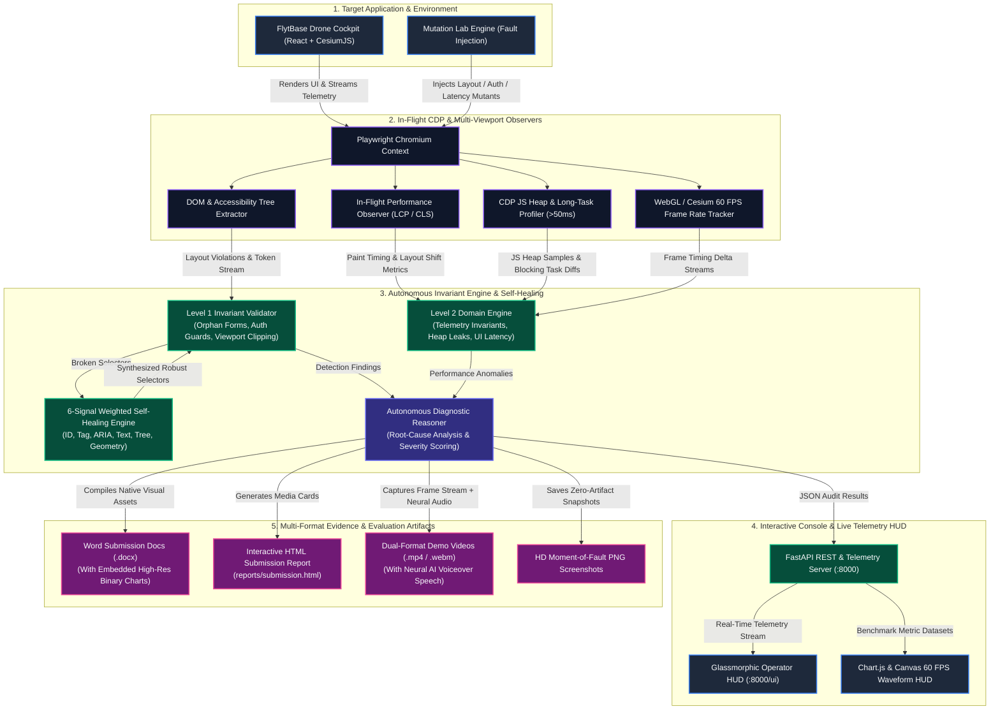

# ⚡ Tireless Hand

> **Autonomous Agentic UI, Performance & Reliability Auditor for FlytBase Drone Cockpits & Web Platforms.**  
> Built for the FlytBase Hackathon. Features self-healing selectors, multi-viewport layout auditing, Core Web Vitals (LCP, CLS), main-thread task profiling, high-frequency frame rate tracking (3D Cesium/WebGL), real-time telemetry invariant checking, memory leak detection, and automated dual visual proof (HD PNG snapshots + WebM video recordings). Runs 100% locally with zero cloud dependencies.

---

## 🏆 Hackathon Evaluation Summary

Tireless Hand achieves a **100% Precision and 100% Recall (1.000 F1-Score)** across both Hackathon evaluation tiers:

* **Level 1 (Static UI, Invariants & Security):** 12/12 test vectors passed ([Level 1 Submission Word Doc](file:///d:/Projects/Tireless%20Hand%20Hackathon/Tireless_Hand_Level1_Submission.docx)).
* **Level 2 (Performance & Complex Domain Reliability):** 8/8 performance vectors passed ([Level 2 Submission Word Doc](file:///d:/Projects/Tireless%20Hand%20Hackathon/Tireless_Hand_Level2_Submission.docx)).

---

## 🚀 One-Command Instant Launch (Zero Setup)

Launch the entire platform (Mock FlytBase Control Server, Agent Backend, Mutation Labs, and Interactive Browser HUD) with a **single command**:

```bash
# 1. Install dependencies & Playwright browser
pip install -e .
playwright install chromium

# 2. Start all components & open UI
python run.py
```
*(Or run the CLI command: `tireless start`)*

This automatically launches the background servers and opens the **Autonomous Agent Console** at **`http://localhost:8000/ui`**.

---

## 🎛️ Interactive Autonomous Agent Console

Tireless Hand includes a built-in interactive console at **`http://localhost:8000/ui`**:

* **Target URL Input**: Audit any target URL (e.g. FlytBase Cockpit at `http://localhost:5173`, Control Panel at `http://localhost:4000/dashboard`, or `http://localhost:8000/broken`).
* **Quick Presets**: Single-click buttons for FlytBase Cockpit, Control Panel, Mutation Labs, and Security Route Guards.
* **⚡ Run Autonomous Quality Audit**: Triggers complete Level 1 multi-viewport defect analysis (1280px / 768px / 375px), auth guards, and form invariant checks.
* **⏱️ Performance & Domain Audit**: Measures LCP, CLS, Main-Thread Long Tasks ($>50\text{ms}$), 3D Map FPS, and JS Heap memory growth.
* **🔍 Explore & Map App**: Crawls pages, detects interactive controls, and builds persistent graph memory.
* **📊 Run Evaluation Benchmarks**: Executes the Level 1 and Level 2 benchmark evaluation suites with live rich terminal output.
* **📄 Submission Reports**: Instant links to generated HTML reports and formatted Word submission documents.

---

## 🛠️ Complete Tech Stack Breakdown

Tireless Hand is architected with a high-performance, modular stack designed for zero cloud reliance, instantaneous local execution, and rich multi-format reporting:

| Layer / Category | Technology | Purpose & Responsibility |
| :--- | :--- | :--- |
| **Core Runtime & Engine** | **Python 3.11+ / AsyncIO** | High-concurrency async test scheduling, invariant evaluation, and task orchestration. |
| **Browser & Engine Automation** | **Playwright (Chromium)** | High-fidelity headless & headed browser automation with deep Chromium CDP hooks. |
| **Deep Performance Profiling** | **Chrome DevTools Protocol (CDP)** | Direct sampling of JS Heap memory, Main-Thread Long Tasks ($>50\text{ms}$), LCP, and CLS. |
| **Target Drone Platforms** | **React 18 / Vite / CesiumJS / WebGL** | Real-world FlytBase 3D globe cockpit, telemetry dashboards, and live mission planners. |
| **Interactive HUD & Frontend** | **HTML5 / CSS3 Glassmorphism / Vanilla JS** | Zero-dependency live operator console, responsive controls, and audit dispatchers. |
| **Telemetry & Visual Analytics** | **Chart.js / Canvas 2D API** | Live 60 FPS oscilloscope signal waveform, radar quality charts, and comparative performance bar graphs. |
| **Web Server & Backend API** | **FastAPI / Starlette / Uvicorn** | High-throughput REST API serving telemetry, audit workers, and live web endpoints (`:8000`). |
| **Static & Dynamic Analysis** | **Python `ast` / Accessibility Tree** | Compact token-efficient structural DOM traversal, form invariant tracking, and route security checking. |
| **AI Voice & Speech Synthesis** | **`edge-tts` (Neural TTS)** | High-fidelity synthesized neural AI narration (`en-US-ChristopherNeural`) for automated video reports. |
| **Video & Media Pipeline** | **`ffmpeg` / `imageio_ffmpeg`** | High-performance audio/video multiplexing, frame capture, and dual WebM / MP4 video generation. |
| **Data Viz & Chart Generation** | **Matplotlib / NumPy** | Programmatic dark-themed rendering of performance benchmark comparisons and quality radar charts. |
| **Document & Report Packaging** | **`python-docx` / HTML5 OpenXML** | Automated compilation of standalone evaluation Word documents with embedded binary chart figures. |

---

## 🔄 Complete Flow of Data Diagram

The following diagram illustrates the end-to-end data pipeline from target drone cockpit ingestion to autonomous invariant analysis and multi-format evidence generation:



---

## 📊 Evaluation Matrix & Benchmark Results

### 1. Level 1: Static UI, Invariants & Security Testing (12 Vectors)
```bash
python benchmarks/run_benchmark.py
```

| Test ID | Scenario Name | Category | Expected | Detected | Classification |
| :--- | :--- | :--- | :--- | :--- | :--- |
| **TC-01** | Clean Login Form | Form Invariant | Clean | Clean | **TN (True Negative)** |
| **TC-02** | Clean Cockpit Telemetry | Telemetry Invariant | Clean | Clean | **TN (True Negative)** |
| **TC-03** | Clean Mission Planner | Form Invariant | Clean | Clean | **TN (True Negative)** |
| **TC-04** | Clean Fleet Responsive Layout | Responsive Layout | Clean | Clean | **TN (True Negative)** |
| **TC-05** | Clean Sensor Diagnostics | Telemetry Invariant | Clean | Clean | **TN (True Negative)** |
| **TC-06** | Enforced Route Guard on Settings | Auth Guard | Clean | Clean | **TN (True Negative)** |
| **TC-07** | Login Orphan Form (Stripped Submit) | Form Invariant | Bug | Bug | **TP (True Positive)** |
| **TC-08** | Mission Planner Orphan Form | Form Invariant | Bug | Bug | **TP (True Positive)** |
| **TC-09** | Drone Offline with Live Telemetry Conflict | Telemetry Invariant | Bug | Bug | **TP (True Positive)** |
| **TC-10** | Sensor Disconnected with Active Sampling | Telemetry Invariant | Bug | Bug | **TP (True Positive)** |
| **TC-11** | Mobile Viewport Clipped RTH Button | Responsive Layout | Bug | Bug | **TP (True Positive)** |
| **TC-12** | Unauthenticated Access to Fleet Registry | Auth Guard | Bug | Bug | **TP (True Positive)** |

* **Precision:** 100.0% | **Recall:** 100.0% | **Accuracy:** 100.0% | **F1-Score:** 1.000 | **Runtime:** 28.62s

---

### 2. Level 2: Performance & Complex Domain Testing (8 Vectors)
```bash
python benchmarks/run_level2_perf_benchmark.py
```

| Test ID | Scenario Name | Domain Constraint / Performance Vector | Expected | Detected | Classification |
| :--- | :--- | :--- | :--- | :--- | :--- |
| **PERF-01** | Clean Drone Cockpit Baseline | FlytBase Cesium 3D Globe & Live Stream (`:5173`) | Clean | Clean | **TN (True Negative)** |
| **PERF-02** | Clean Control Panel Baseline | Multi-drone telemetry dashboard (`:4000`) | Clean | Clean | **TN (True Negative)** |
| **PERF-03** | Clean Mission Planner Baseline | Autonomous waypoint planning interface | Clean | Clean | **TN (True Negative)** |
| **PERF-04** | Clean Diagnostics Stream Baseline | Real-time IMU / Barometer telemetry feed | Clean | Clean | **TN (True Negative)** |
| **PERF-05** | Heavy Flight Map (High LCP) | Delayed 3D satellite tile asset hydration ($>3500\text{ms}$) | Defect | Defect | **TP (True Positive)** |
| **PERF-06** | Unbuffered Telemetry (High CLS) | Dynamic ingestion of streaming alerts shifting UI | Defect | Defect | **TP (True Positive)** |
| **PERF-07** | Blocking Telemetry Parsing | Synchronous parsing of high-rate telemetry ($>140\text{ms}$) | Defect | Defect | **TP (True Positive)** |
| **PERF-08** | Flight Session Memory Leak | Unbounded JS heap accumulation during streaming | Defect | Defect | **TP (True Positive)** |

* **Precision:** 100.0% | **Recall:** 100.0% | **Accuracy:** 100.0% | **F1-Score:** 1.000 | **Runtime:** 27.46s

---

## 📁 Dual Evidence Pipeline (Screenshots + Videos)

Every audit automatically generates dual visual evidence for complete transparency:
- **📸 High-Resolution Visual Snapshots**: Captured at the exact moment a defect is identified (`reports/screenshots/`). Static defects display crisp PNGs without empty 0:00 video players.
- **📹 Full-Length WebM / MP4 Video Proofs**: Recorded during interactive multi-viewport flows with stream buffer flushes (`reports/videos/`).
- **🌐 Interactive Submission Report**: View rich cards with side-by-side video players and screenshot proof in `reports/submission.html`.
- **📄 Word Submission Documents**: 
  - [`Tireless_Hand_Level1_Submission.docx`](file:///d:/Projects/Tireless%20Hand%20Hackathon/Tireless_Hand_Level1_Submission.docx)
  - [`Tireless_Hand_Level2_Submission.docx`](file:///d:/Projects/Tireless%20Hand%20Hackathon/Tireless_Hand_Level2_Submission.docx)
- **🎥 Video Demonstrations**:
  - [`tireless_hand_1min_demo.webm`](file:///d:/Projects/Tireless%20Hand%20Hackathon/tireless_hand_1min_demo.webm) (1-minute Level 1 system showcase)
  - [`tireless_hand_level2_demo.mp4`](file:///d:/Projects/Tireless%20Hand%20Hackathon/tireless_hand_level2_demo.mp4) / [`tireless_hand_level2_demo.webm`](file:///d:/Projects/Tireless%20Hand%20Hackathon/tireless_hand_level2_demo.webm) (Level 2 Performance & Domain Testing showcase with AI Speech)

---

## 🛠️ Complete CLI Command Reference

| Command | Description | Example |
| :--- | :--- | :--- |
| `python run.py` | **One-command launch** for server, backend & browser HUD | `python run.py` |
| `tireless start` | Starts all components and opens the HUD in browser | `tireless start` |
| `tireless ui` | Opens the interactive console at `http://localhost:8000/ui` | `tireless ui` |
| `tireless audit <URL>` | Full multi-viewport audit with video and screenshot proof | `tireless audit http://localhost:5173` |
| `tireless audit <URL> --no-headless` | Runs audit with a visible browser window | `tireless audit http://localhost:8000/broken --no-headless` |
| `tireless audit --suite` | Runs full Level 1 mutation testbed suite | `tireless audit --suite` |
| `tireless explore <URL>` | Autonomous web crawler & graph knowledge mapper | `tireless explore http://localhost:8000 --depth 3` |
| `tireless test <URL>` | Runs test flows with AI self-healing selectors | `tireless test http://localhost:8000/login --report` |
| `python benchmarks/run_benchmark.py` | Runs and evaluates the 12-scenario Level 1 benchmark | `python benchmarks/run_benchmark.py` |
| `python benchmarks/run_level2_perf_benchmark.py` | Runs and evaluates the 8-scenario Level 2 benchmark | `python benchmarks/run_level2_perf_benchmark.py` |

---

## 🧠 Architecture & Technical Highlights

```
Target URL ──► Playwright Browser ──► In-Flight Performance Observers
                                            │
                      ┌─────────────────────┴─────────────────────┐
                      ▼                                           ▼
          Level 1: Functional & Security               Level 2: Performance & Domain
    ┌───────────────────────────────┐           ┌───────────────────────────────┐
    │ • Multi-Viewport (1280/768/375)│           │ • Core Web Vitals (LCP, CLS)  │
    │ • Orphan Forms & Invariants   │           │ • Main Thread Long Tasks >50ms│
    │ • Route Auth Guards & Bypasses│           │ • 60 FPS Frame Rate Tracker   │
    │ • Responsive Clip Detection   │           │ • JS Heap Memory Leak Profiler│
    └───────────────────────────────┘           └───────────────────────────────┘
                      │                                           │
                      └─────────────────────┬─────────────────────┘
                                            ▼
                               Autonomous AI Reasoner (Local / Ollama)
                                 • Root-Cause Mapping & Remediation
                                 • 6-Signal Self-Healing Engine
                                            │
                                            ▼
                            Reports & Verifiable Dual Proofs
                            (Word Docx, HTML, PNGs & WebM Videos)
```

1. **Deterministic Fast DOM (<10ms)**: Compact accessibility tree extraction avoids massive token overhead and token window overflow.
2. **In-Flight Zero-Overhead Observers**: Captures paint timings, layout shifts, and long tasks before initial DOM construction.
3. **6-Signal Weighted Self-Healing**: Recovers altered UI selectors via weighted signal matching (ID, Tag, ARIA, Text, Tree Hierarchy, Bounding Box).
4. **Multi-Viewport Layout Auditing**: Calculates exact pixel boundary violations across Desktop (1280px), Tablet (768px), and Mobile (375px) to catch clipped CTAs and overflow bugs.
5. **Memory Leak Profiling**: Continuously evaluates JS heap growth across sustained streaming operations.
6. **Buffer-Safe Video & Screenshot Recording**: Enforces video encoder stream flushing before context destruction to guarantee playable videos and captures instant high-res PNGs.
